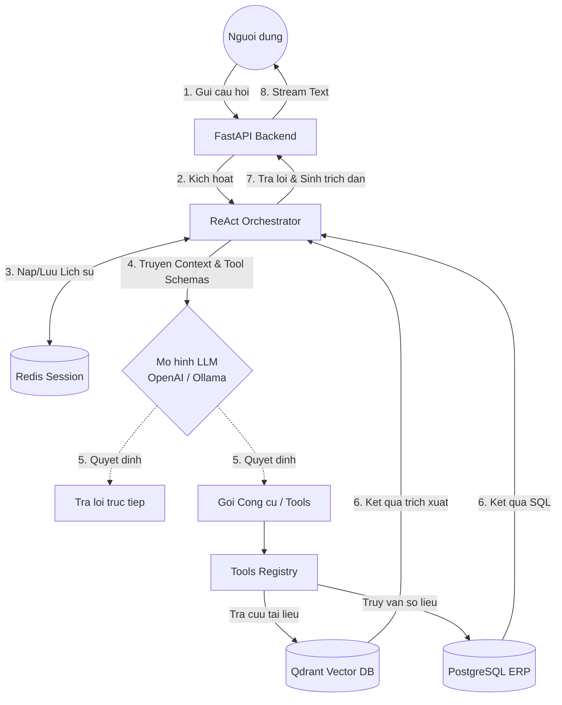

# ERP Agentic Chatbot

Hệ thống Trợ lý AI thông minh dành cho doanh nghiệp, được xây dựng dựa trên kiến trúc **ReAct Agent**. Trợ lý có khả năng linh hoạt phối hợp giữa việc **truy vấn trực tiếp cơ sở dữ liệu ERP** (dữ liệu nhân viên, tồn kho, doanh thu) và **tìm kiếm tài liệu nội bộ** (RAG - quy trình, chính sách, hợp đồng) để giải quyết các yêu cầu phức tạp của người dùng.

---

## Yêu cầu hệ thống (Prerequisites)

Dự án yêu cầu các công cụ và cơ sở dữ liệu sau để hoạt động:
- **Python:** Khuyến nghị phiên bản 3.10 trở lên.
- **PostgreSQL:** Chứa cơ sở dữ liệu ERP gốc của doanh nghiệp.
- **Redis:** Quản lý bộ nhớ tạm (Cache kết quả RAG) và Lịch sử hội thoại (Session Store).
- **Qdrant:** Vector Database dùng để lưu trữ và truy xuất các embeddings của tài liệu (RAG).
- **RAM/GPU:** Khuyến nghị có GPU (CUDA) nếu triển khai các model LLM, Embedding và Reranker cục bộ để tối ưu tốc độ xử lý.

---

## Kiến trúc & Luồng hoạt động (System Flow)

Hệ thống hoạt động dựa trên vòng lặp **Reasoning and Acting (ReAct)**. Dưới đây là sơ đồ luồng xử lý cơ bản khi người dùng đặt câu hỏi:



## Thiết lập môi trường

### 1. Khởi tạo Cơ sở hạ tầng với Docker

```bash
# Khởi chạy Redis
docker run -d --name redis-erp -p 6379:6379 redis

# Khởi chạy Qdrant
docker run -d --name qdrant-erp -p 6333:6333 qdrant/qdrant

# Khởi chạy PostgreSQL (nếu chưa có sẵn DB)
docker run -d --name postgres-erp -p 5432:5432 \
  -e POSTGRES_USER=erp_user \
  -e POSTGRES_PASSWORD=erp_secret \
  -e POSTGRES_DB=erp_chatbot postgres
```

### 2. Cài đặt thư viện Python
Tạo môi trường ảo (Virtual Environment) và cài đặt các gói phụ thuộc:

```bash
python -m venv venv

# Kích hoạt môi trường (Windows)
venv\Scripts\activate
# Kích hoạt môi trường (Linux/Mac)
source venv/bin/activate

# Cài đặt các thư viện thiết yếu
pip install .
```

### 3. Cấu hình ứng dụng (.env)
Tạo một file `.env` ở thư mục gốc của dự án (`c:\erp_agent\.env`) và thiết lập các biến môi trường sau:

```env
# --- Ứng dụng ---
APP_NAME="ERP Agentic Chatbot"
APP_ENV="development"

# --- Cấu hình LLM ---
LLM_PROVIDER=""  (Provider list: ollama, openai, anthropic, gemini, ...)

OPENAI_API_KEY="sk-your-api-key"
ANTHROPIC_API_KEY="sk-your-api-key"
GEMINI_API_KEY="sk-your-api-key"

LLM_MODEL="your_model_name"
LLM_MAX_TOKENS=None
LLM_TEMPERATURE=None
LLM_MAX_TOOL_ITERATIONS=None

LLM_BASE_URL=""

# --- Database ERP (PostgreSQL) ---
ERP_DB_HOST=localhost
ERP_DB_PORT=5432
ERP_DB_NAME=erp_chatbot
ERP_DB_USER=erp_user
ERP_DB_PASSWORD=
ERP_DB_POOL_SIZE=10
ERP_DB_POOL_TIMEOUT=30

# --- Redis ---
REDIS_HOST=localhost
REDIS_PORT=6379
REDIS_PASSWORD=
REDIS_DB=0
REDIS_SESSION_TTL=86400
REDIS_CACHE_TTL=300

# --- Vector Store (Qdrant) ---
VECTOR_STORE_PROVIDER="qdrant"
QDRANT_URL=http://localhost:6333
QDRANT_COLLECTION=erp_docs
QDRANT_API_KEY=QDRANT_API_KEY

# --- Embeddings ---
EMBEDDING_MODEL=AITeamVN/Vietnamese_Embedding
EMBEDDING_DIM=1024

# --- MCP Server ---
MCP_SERVER_HOST=localhost
MCP_SERVER_PORT=8100
MCP_TIMEOUT=30
```

---

## Hướng dẫn Khởi chạy

Bạn có thể khởi chạy ứng dụng chính bằng Uvicorn. Khi server khởi động, nó sẽ tự động kết nối với Pool DB, Redis và kiểm tra Qdrant.

```bash
# Chạy FastAPI Backend (Server tự động reload khi sửa code)
uvicorn main:app --reload --host 0.0.0.0 --port 8000
```

Sau khi console báo `app.ready`, bạn có thể truy cập **Swagger UI** để kiểm tra và gọi thử các API tại địa chỉ:  
👉 **http://localhost:8000/docs**

*(Tùy chọn) Khởi chạy công cụ MCP Server độc lập nếu có ứng dụng client MCP kết nối riêng:*
```bash
python -m mcp_tools.server
```